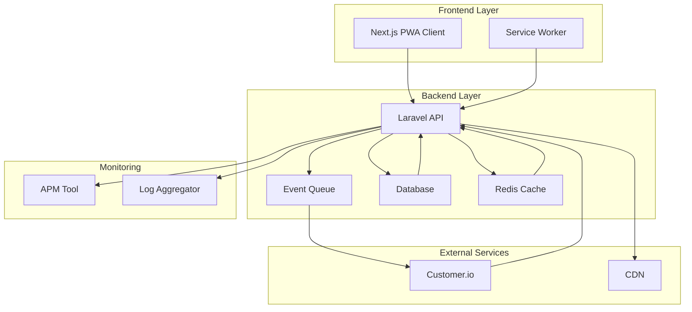
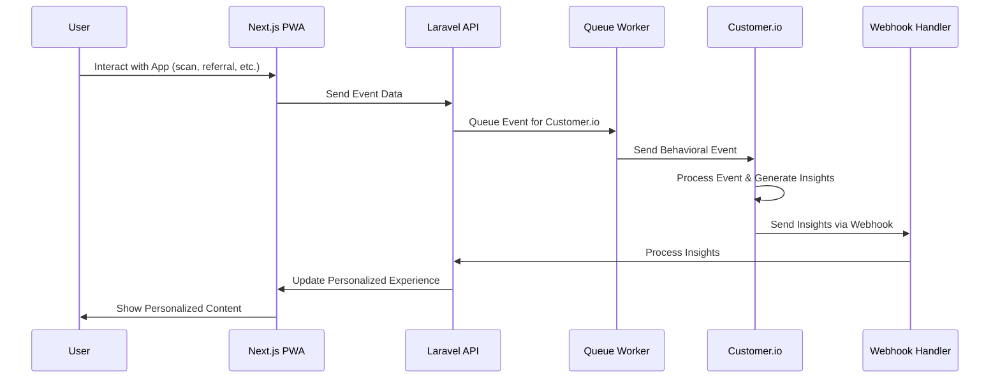
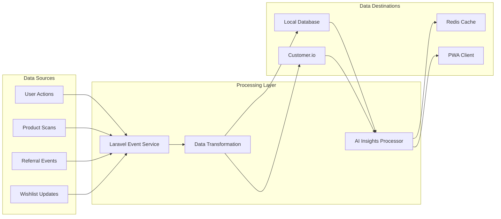
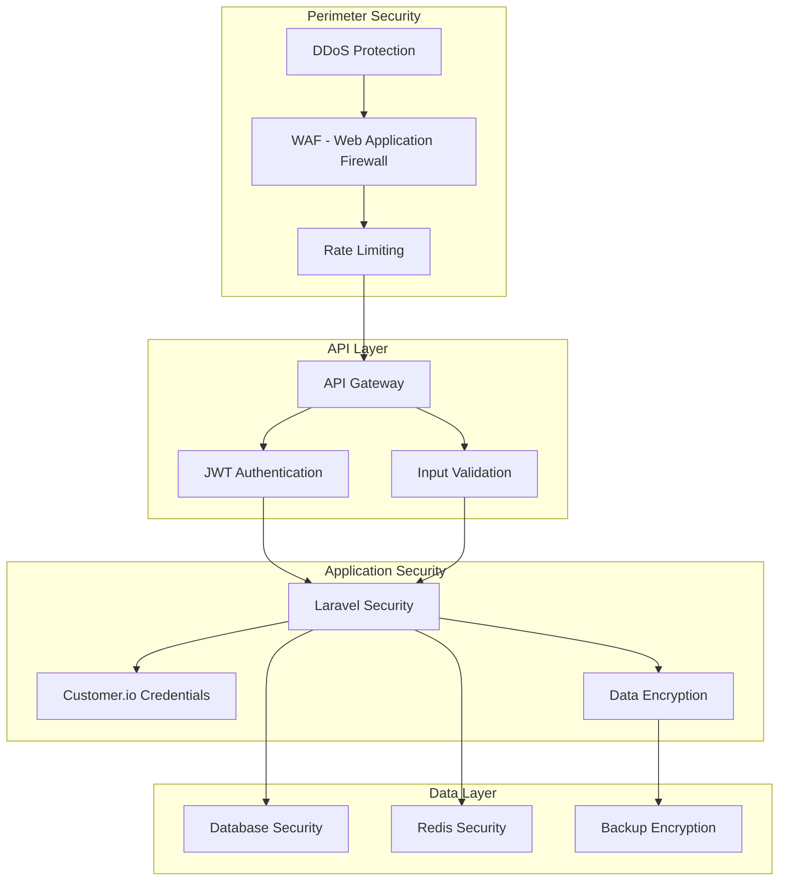
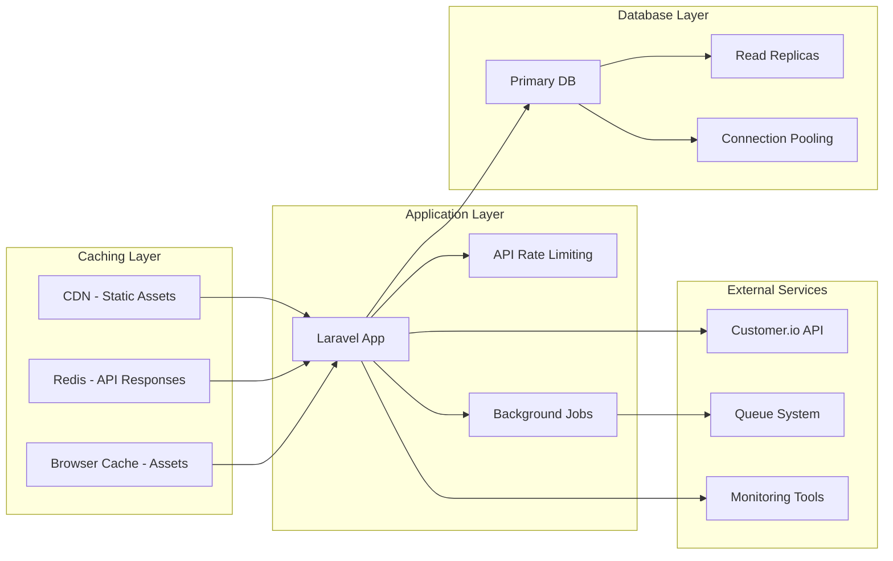

## System Architecture Diagrams

**Document Version:** 1.0  
**Status:** Draft  
**Date:** October 8, 2025

### Overview
This document contains system architecture diagrams for the CannaRewards Synergy Engine platform. These diagrams visually represent the system components, data flows, and interactions with external services like Customer.io.

### 1. High-Level Architecture Overview

### 2. Customer.io Integration Flow

### 3. Data Flow Architecture

### 4. Security Architecture

### 5. Performance Architecture
